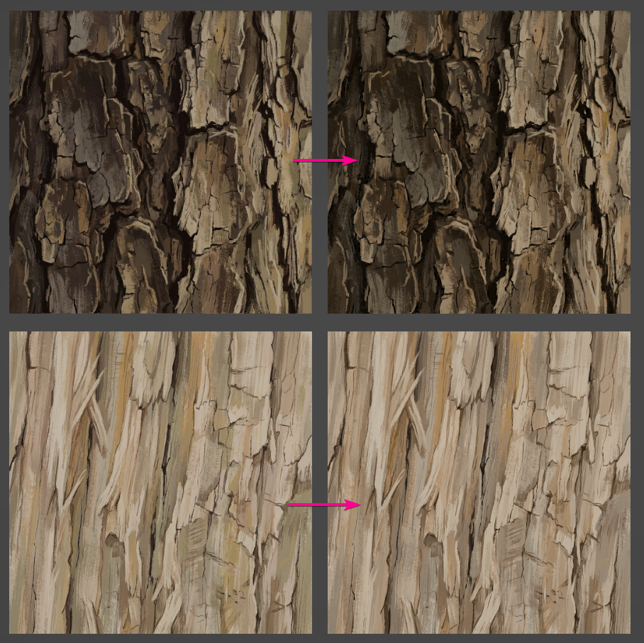

<p align="center">
  
</p>

<div align="center">

# 2ChannelColorEncoding

**Unity-инструмент для кодирования цветной текстуры в два канала**

по методу из **GPU Pro 5 — "Reducing Texture Memory Usage by 2-Channel Color Encoding"**

[English below](#english)

</div>

---

## На русском

Инструмент анализирует исходную текстуру, строит цветовую плоскость в RGB-пространстве, находит два базовых цвета на пересечении плоскости с единичным кубом, и кодирует каждый тексель как:

- **R** = закодированная яркость (√L)
- **G** = фактор оттенка (t) — интерполяция между базовыми цветами

При декодировании оригинальный цвет восстанавливается блендингом базовых цветов с масштабированием до сохранённой яркости.

### Зачем это нужно

Техника полезна для текстур, чьи цвета лежат в узком диапазоне:

- рельеф, грунт, камень
- листва, кора, дерево
- диффузные/albedo карты одного материала

Это **не** универсальная замена RGB. Метод работает лучше всего, когда исходную текстуру можно аппроксимировать двумерным цветовым пространством.

### Как это работает

Реализация следует идее из главы:

1. Исходные тексели переводятся в линейное RGB (pow(c, gamma)).
2. Применяются весовые коэффициенты каналов для улучшения перцептуального фиттинга.
3. Через чёрную точку (0,0,0) строится плоскость, минимизирующая сумму квадратов расстояний до тексельного облака (собственный вектор scatter-матрицы с минимальным значением).
4. Вычисляются два базовых цвета (`bc1`, `bc2`) обходом силуэта куба — пересечение плоскости с рёбрами силуэта RGB-куба.
5. Каждый тексель кодируется в два значения: яркость и фактор оттенка.
6. Декодирование: `lerp(bc1, bc2, t)` с масштабированием до сохранённой яркости.

---

<div align="center">

#

</div>

---

<a id="english"></a>

<div align="center">

# 2ChannelColorEncoding

**Unity Editor tool that encodes a color texture into two channels**

using the method from **GPU Pro 5 — "Reducing Texture Memory Usage by 2-Channel Color Encoding"**

</div>

<br>

The tool analyzes the source texture, fits a color plane in RGB space, extracts two base colors from the plane/cube intersection, and encodes each texel as:

- **R** = encoded luminance (√L)
- **G** = hue factor (t) — interpolation between the two base colors

At runtime, the original color is reconstructed by blending the base colors and rescaling to the stored luminance.

## What this is for

Useful for textures whose colors lie close to a limited range:

- terrain, dirt, stone
- foliage, bark, wood
- single-material diffuse/albedo maps

It is **not** a universal replacement for full RGB. Works best when the source texture can be approximated by a 2D color space.

## How it works

The implementation follows the core idea from the chapter:

1. Convert source texels to approximate linear RGB (`pow(c, gamma)`).
2. Apply channel weights to improve perceptual fitting.
3. Fit a plane through the origin that minimizes squared distance to the texel cloud (smallest eigenvector of the scatter matrix).
4. Compute two base colors (`bc1`, `bc2`) from the intersection of that plane with the RGB cube silhouette.
5. Encode each texel as luminance + hue factor.
6. Decode: `lerp(bc1, bc2, t)`, rescale to stored luminance.

---

## Installation

1. Clone or copy this repository into your Unity project's `Packages/` folder:
   ```
   Packages/com.unitycgchat.2channelcolorencoding
   ```
   Or add via Package Manager → "Add package from disk" → select `package.json`.

2. If you want the URP decode shader, import the **URP Decode Shader** sample from Package Manager.

---

## Usage

1. Open **Window → 2-Channel Color Encoding**.
2. Assign a source texture (albedo/color map).
3. Adjust settings if needed (gamma, channel weights, compression).
4. Click **Encode**.
5. The tool generates:
   - An encoded texture (RG channels)
   - A `TwoChannelColorEncodingAsset` with base colors and metadata
   - Preview textures (decoded, error heatmap, hue, plane visualization)

The encoded texture is saved next to the source. The metadata asset stores `bc1`, `bc2`, gamma, and weights needed for decoding.

---

## Encoding pipeline

```
Source Texture
      │
      ▼
┌─────────────────────┐
│  Read pixels         │
│  (GPU blit → RGBAFloat) │
└─────────┬───────────┘
          │
          ▼
┌─────────────────────┐
│  Scatter matrix      │
│  accumulate weighted │
│  linear RGB stats    │
└─────────┬───────────┘
          │
          ▼
┌─────────────────────┐
│  Smallest eigen-    │
│  vector → plane     │
│  normal             │
└─────────┬───────────┘
          │
          ▼
┌─────────────────────┐
│  Silhouette walk    │
│  → bc1, bc2         │
└─────────┬───────────┘
          │
          ▼
┌─────────────────────┐
│  Per-texel encode   │
│  R = √(luminance)   │
│  G = hue factor t   │
└─────────┬───────────┘
          │
          ▼
  Encoded texture + metadata asset
```

### Channel packing

Optionally pack extra texture channels into B and A of the output:

- **B** ← selected channel from a second texture
- **A** ← selected channel from a third texture

The output switches from RG16 to RGBA32 format automatically.

---

## Decoding shader

The runtime decode is a single HLSL function — no C# needed at runtime.

### Included decode functions (`TwoChannelColorDecode.hlsl`)

| Function | Description |
|---|---|
| `Decode2ChannelColor(data, bc1, bc2)` | Returns linear RGB |
| `Decode2ChannelColorToGamma(data, bc1, bc2, invGamma)` | Returns gamma-corrected RGB |
| `SampleEncodedRG(tex, sampler, uv)` | Samples R and G channels |

### URP shader

The sample includes a complete URP Unlit shader (`TwoChannelColor/Decode Unlit`) with:

- Forward pass with fog support
- ShadowCaster pass
- DepthOnly pass

### Using the asset inspector

Select a `TwoChannelColorEncodingAsset` → click **Create Material**. The material is configured automatically with the correct base colors, gamma, and texture reference.

### Manual shader setup

```hlsl
#include "Packages/com.unitycgchat.2channelcolorencoding/Runtime/Shaders/TwoChannelColorDecode.hlsl"

float2 data = SAMPLE_TEXTURE2D(_EncodedTex, sampler_EncodedTex, uv).rg;
float invGamma = 1.0 / _DecodeGamma;
float3 color = Decode2ChannelColorToGamma(data, _BC1, _BC2, invGamma);
```

Material properties:

| Property | Type | Description |
|---|---|---|
| `_EncodedTex` | Texture2D | Encoded RG texture |
| `_BC1` | Vector3 | First base color (linear RGB) |
| `_BC2` | Vector3 | Second base color (linear RGB) |
| `_DecodeGamma` | Float | Gamma value (default 2.0) |

---

## Project structure

```
Runtime/
  TwoChannelColorEncoding.Runtime.asmdef
  TwoChannelColorEncodingAsset.cs       # Asset + enums (ChannelSource, CompressionFormat, OutputFileFormat)
  Shaders/
    TwoChannelColorDecode.hlsl          # Runtime decode functions

Editor/
  TwoChannelColorEncoding.Editor.asmdef
  TwoChannelColorEncodingWindow.cs      # Main editor window
  EncoderFacade.cs                      # High-level encode entry point
  FitPipeline.cs                        # Plane fitting + encoding + error measurement
  PlaneGeometry.cs                      # Silhouette walk → bc1, bc2 + plane basis
  LinearAlgebra.cs                      # Jacobi eigenvector, brute-force normal
  ScatterMatrix.cs                      # Accumulated RGB statistics
  ColorEncoding.cs                      # Encode/decode luminance, hue factor, color
  ColorSpace.cs                         # Linear↔gamma, luminance
  EncodingConstants.cs                  # Epsilons, luminance weights, thresholds
  EncodingData.cs                       # Settings, data, assets structs
  AssetPipeline.cs                      # Texture I/O, pixel reading, import settings
  PreviewGenerator.cs                   # Decoded preview, error heatmap, hue viz, plane viz

Tests/Editor/
  TwoChannelColorMathTests.cs           # Unit tests for math pipeline

Samples~/URP Decode Shader/
  TwoChannelColorDecodeShader.shader    # Complete URP shader
  TwoChannelColorEncodingAssetEditor.cs # "Create Material" button in inspector
```

---

## Known issues

- Highly colorful or multi-material textures may reconstruct poorly — always check error metrics.
- Compression format choice still matters; 2-channel encoding alone does not automatically guarantee memory savings.
- The tool runs in the Editor only; runtime decoding is shader-only.
- `BruteForceNormal` is retained for reference/testing but is not used by default (Jacobi eigenvector is always used).

---

## Features

- Unity Editor workflow with visual previews
- Plane fitting from accumulated RGB statistics
- Base color extraction via silhouette traversal
- Luminance-based reconstruction
- Error measurement (RMS, max, luminance delta, hue range)
- Channel packing for extra data (B, A)
- Multiple output formats (PNG, TGA)
- Platform-specific compression settings (BC5, BC7, DXT5, EAC, ASTC)

## Limitations

- Best suited for textures with compact color distribution
- Not suitable for textures spanning the full RGB gamut
- Gamma is a simple power curve, not the exact sRGB transfer function
- Results should be validated visually and via error metrics

## References

- **GPU Pro 5**
- Chapter: **Reducing Texture Memory Usage by 2-Channel Color Encoding**
- Author: **Krzysztof Kluczek**

## Status

Work in progress.
The mathematical core is implemented and being refined for better Unity integration, preview consistency, and asset pipeline robustness.
